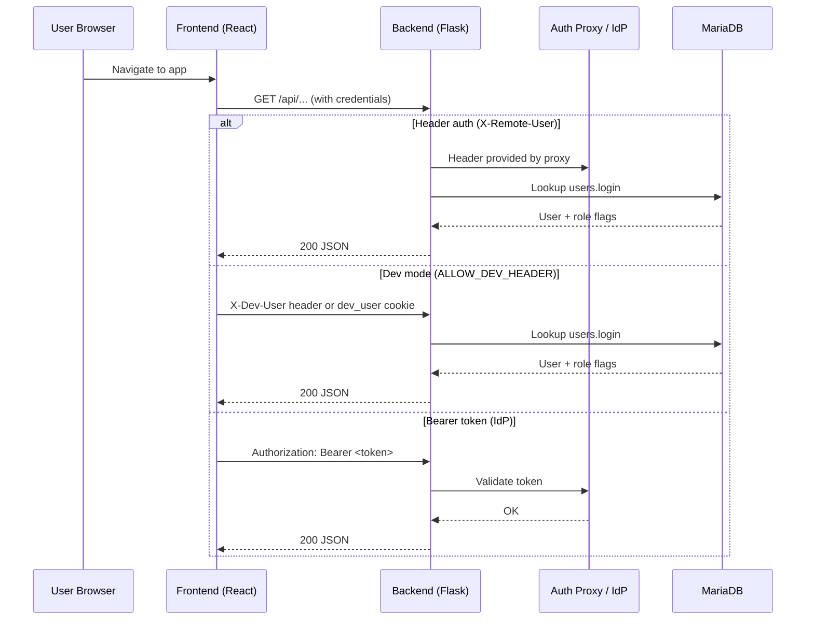
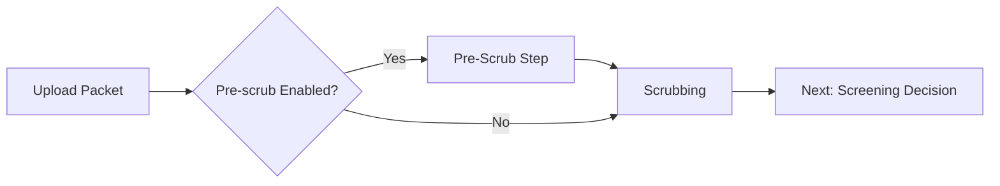

### CNICS Validation – Workflow (Acronyms Expanded)

This chart‑first overview shows how the system fits together, how requests flow (including authentication), and how events move through their lifecycle. Acronyms are expanded on first use. Detailed reference text follows the diagrams.

## Acronyms

- API: Application Programming Interface
- REST: Representational State Transfer
- SPA: Single‑Page Application
- CORS: Cross‑Origin Resource Sharing
- FHIR: Fast Healthcare Interoperability Resources
- IdP: Identity Provider (e.g., Keycloak)
- VM: Virtual Machine
- CSV: Comma‑Separated Values

## Stack Overview

```mermaid
flowchart LR
  subgraph Browser
    UI[React SPA\n(frontend/)]
  end

  subgraph Backend[Flask API\n(flask_backend/)]
    API[/REST Endpoints/]
    Files[/Static /files and downloads/]
  end

  DB[(MariaDB)]

  UI -- VITE_API_URL or same-origin /api --> API
  API -- SQLAlchemy --> DB
  UI -- GET /files/... --> Files
```

## Request & Authentication Flow



## Event Lifecycle (High Level)

```mermaid
flowchart LR
  A[Create Event\nPOST /api/events (admin)] --> B[Upload Packet\nPOST /api/events/:id/upload_scrubbed\n(uploader/reviewer/admin)]
  B --> C[Scrubbed]
  C --> D[Screening Decision\nPOST /api/events/:id/screen\n(reviewer/admin)]
  D -->|accept| E[Screened]
  D -->|rescrub| B
  D -->|reject| R[Rejected]
  E --> F[Assign Many\nPOST /api/events/assign_many (admin)]
  F --> G[Send Many\nPOST /api/events/send_many (admin)]
  G --> H[Reviewer Queues\nGET /api/reviewer/awaiting]
  H --> I[CSV Export\nGET /api/events/export (admin)]
```

## Review Process (Parallel First/Second Reviewers; Third as Tiebreaker)

```mermaid
flowchart LR
  A[Assigned for Review] --> R1[Reviewer 1 Works]
  A --> R2[Reviewer 2 Works]
  R1 --> J{Do R1 and R2 Agree?}
  R2 --> J
  J -->|Yes| F[Finalize Outcome]
  J -->|No| R3[Third Reviewer (Tiebreaker)] --> F
```

Notes:
- First and second reviewers work in parallel.
- Third reviewer is only invoked when Reviewer 1 and Reviewer 2 disagree; acts as a tiebreaker.

## Optional Pre‑Scrub Step (Feature Toggle)



Proposed feature flags:
- ENABLE_PRESCRUB (boolean): When enabled, enforce a pre‑scrubbing step prior to scrubbing (useful to adapt flows across systems).
- PARALLEL_REVIEWS (boolean, default true): Retain parallel first/second reviewer behavior; when false, enforce serial R1 → R2.

## File Flows

```mermaid
flowchart TB
  subgraph Host/Docker
    FDIR[FILES_DIR (ro): app/webroot/files or mounted]
    DDIR[DOWNLOADS_DIR/UPLOAD_DIR (rw): downloads/ mount]
  end

  AUI[Frontend UI]
  BE[Flask Backend]

  AUI -- GET /files/<name> --> BE
  BE --> FDIR
  BE -- stream file --> AUI

  AUI -- POST scrubbed_file --> BE
  BE --> DDIR
  AUI -- GET /api/events/download/:id --> BE
  BE --> DDIR
  BE -- attach correct MIME --> AUI
```

## Configuration (Expanded)

- Copy `.env.example` to `.env` at repo root; Docker Compose interpolates values.
- Key variables:
  - DB_*: MariaDB credentials (root password, database, user, password).
  - FRONTEND_ORIGIN: Allowed origin for CORS (Cross‑Origin Resource Sharing) requests to the backend.
  - VITE_API_URL: Base URL to the backend API (Application Programming Interface) for the React SPA; leave empty for same‑origin.
  - FILES_DIR: Read‑only mount for instruction files, served under `/files/<name>`.
  - DOWNLOADS_DIR or UPLOAD_DIR: Writable mount for generated or uploaded artifacts (e.g., scrubbed ZIP/PDF/DOC/DOCX).
  - FHIR_SERVER: Fast Healthcare Interoperability Resources server URL (if applicable).
  - ALLOW_DEV_HEADER=1: Enables development authentication helpers and cookie/header overrides.

## Project status and next steps (from Friday meeting)

- Authentication testing:
  - Role‑specific test accounts exist; UI currently shows admin for all. Backend role mapping is correct; prefer manual database toggling for validation.
  - UI user management is not a near‑term priority for production.
- JSON logging:
  - Error handling logs are implemented (system standard out). Convert Flask’s default request logging to JSON for consistency (consider a JSON logging library).
  - Log server to be deployed on a separate VM for testing.
- Email system:
  - Templates are ready; blocked on mailbox credentials and send privileges.
- Workflow documentation:
  - This document adds parallel first/second reviewers with a third reviewer as tiebreaker; to be reviewed and refined.
- Roadmap checkpoints:
  - Done: authentication wiring, file persistence, large‑table handling with pagination.
  - Pending: process events through entire workflow (awaiting role‑testing resolution).
  - Add pre‑scrub step behind ENABLE_PRESCRUB feature flag.


