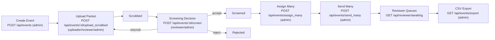
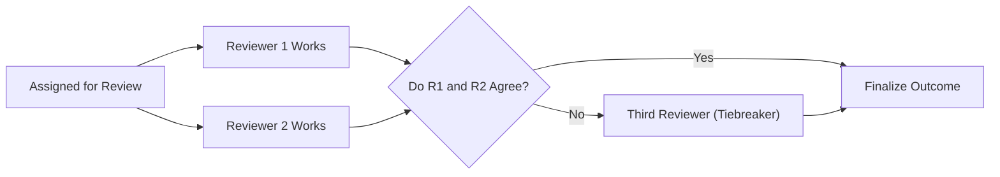
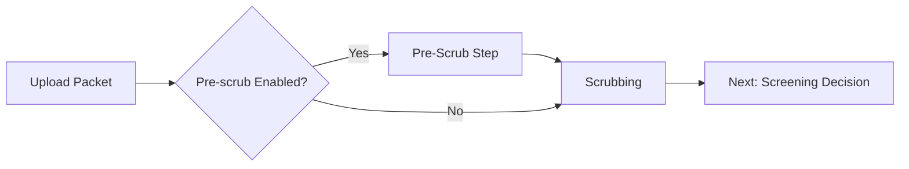
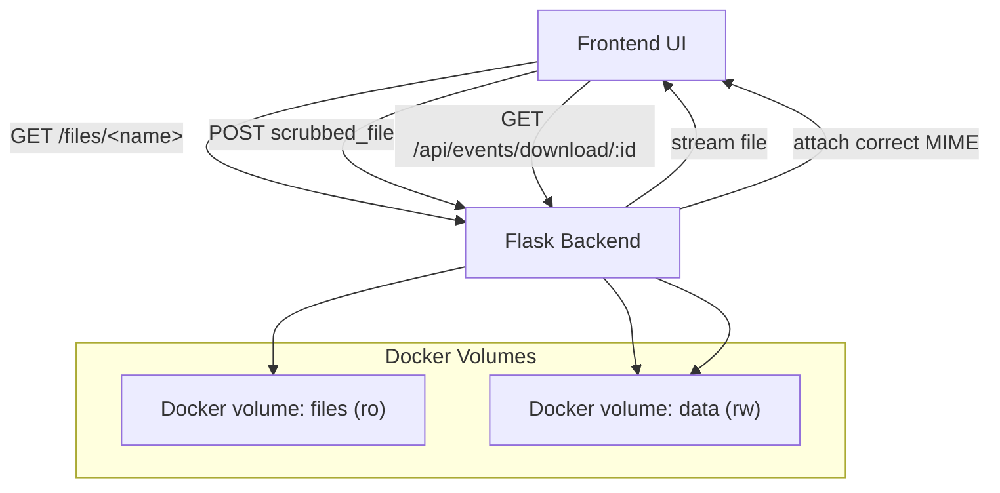

### CNICS Validation – Workflow 
(Generated by AI)
This chart‑first overview shows how the system fits together, how requests flow (including authentication), and how events move through their lifecycle. Acronyms are expanded on first use. Detailed reference text follows the diagrams.

## Event Lifecycle (High Level)

## Review Process (Parallel First/Second Reviewers; Third as Tiebreaker)

Notes:
- First and second reviewers work in parallel.
- Third reviewer is only invoked when Reviewer 1 and Reviewer 2 disagree; acts as a tiebreaker.

## Optional Pre‑Scrub Step (Feature Toggle)

Proposed feature flags:
- ENABLE_PRESCRUB (boolean): When enabled, enforce a pre‑scrubbing step prior to scrubbing (useful to adapt flows across systems).
- PARALLEL_REVIEWS (boolean, default true): Retain parallel first/second reviewer behavior; when false, enforce serial R1 → R2.

## File Flows

