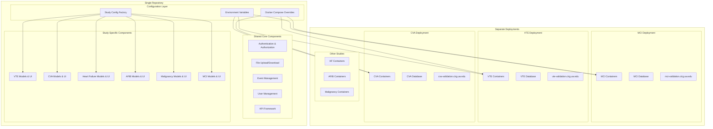
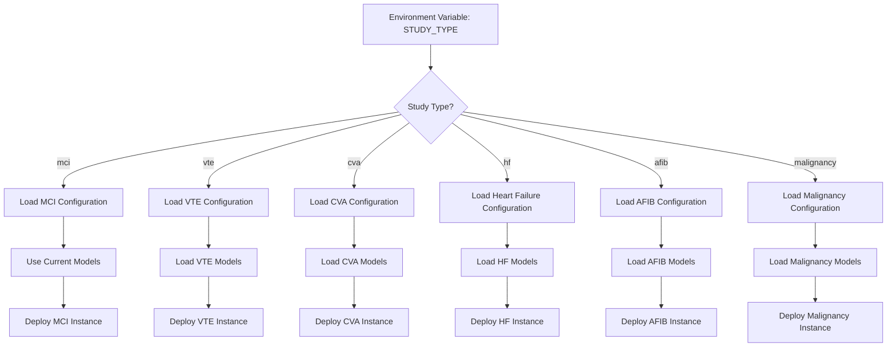
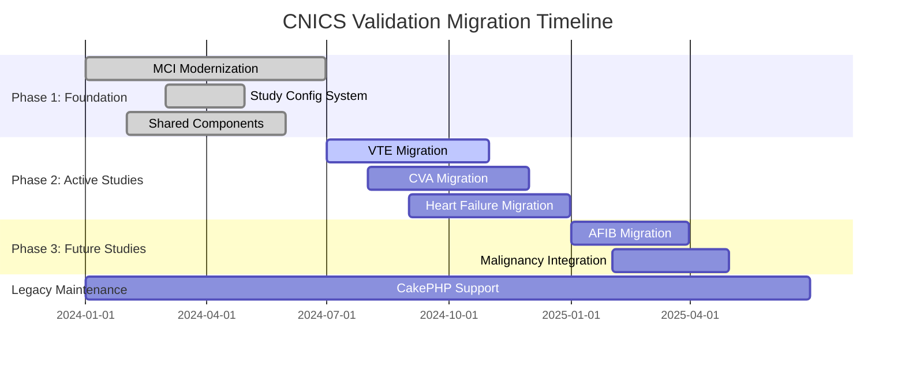
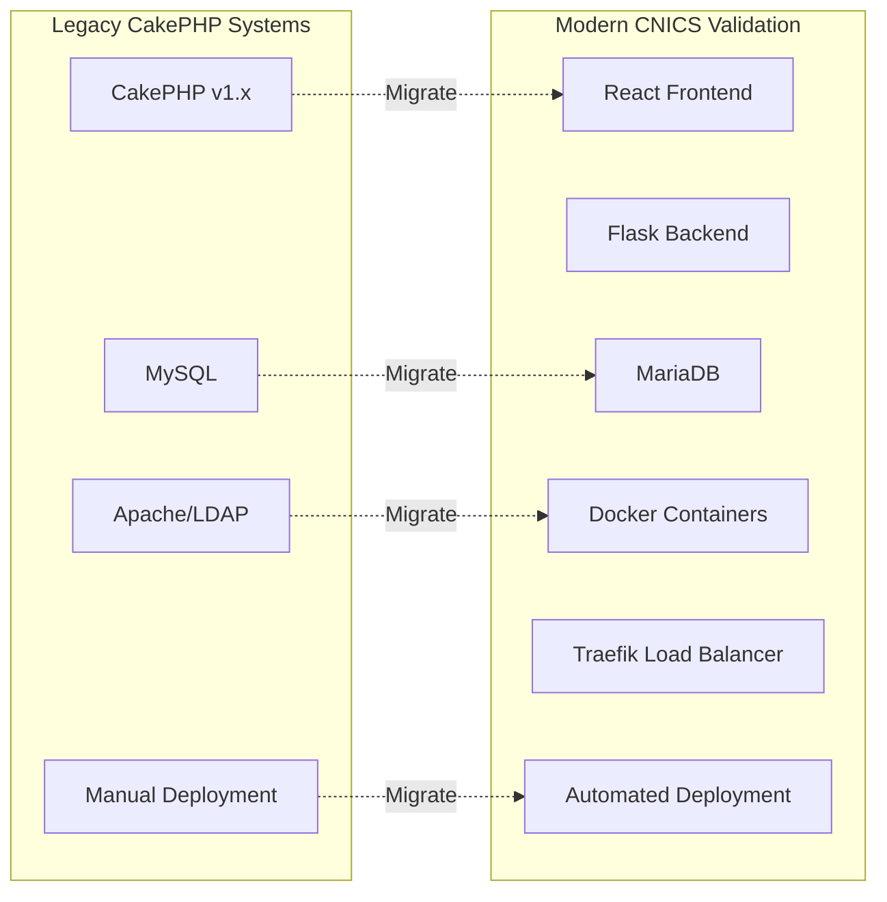
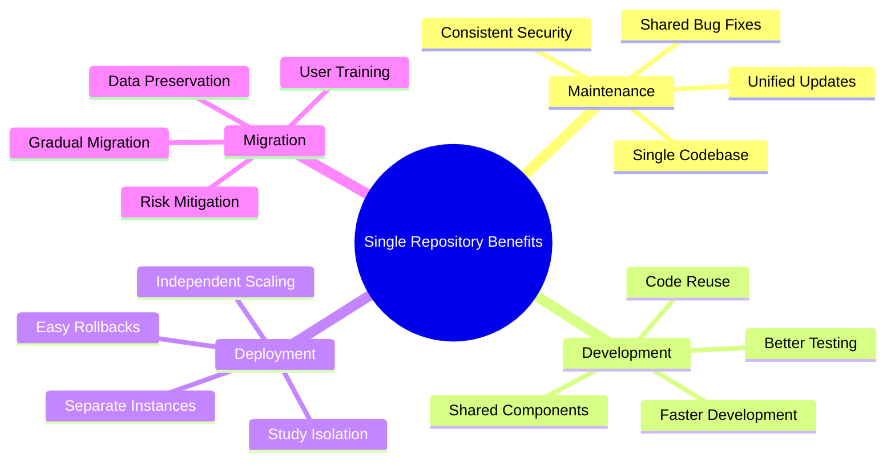

# CNICS Validation Multi-Study Architecture Diagrams

## 1. Overall System Architecture



## 2. Study Configuration Flow



## 3. Database Schema Strategy

```mermaid
graph TB
    subgraph "Shared Core Tables"
        EVENTS[Events Table<br/>- id (PK)<br/>- patient_id (FK)<br/>- creator_id (FK)<br/>- status<br/>- created_date]
        USERS[Users Table<br/>- id (PK)<br/>- login<br/>- name<br/>- admin_flag<br/>- uploader_flag<br/>- reviewer_flag]
        LOGS[Logs Table<br/>- id (PK)<br/>- user_id (FK)<br/>- action<br/>- timestamp]
        PATIENTS[Patients Table<br/>- id (PK)<br/>- site_patient_id<br/>- site]
        CRITERIAS[Criterias Table<br/>- id (PK)<br/>- event_id (FK)<br/>- criteria_text]
    end
    
    subgraph "Study-Specific Review Tables"
        MCI_REVIEWS[MCI Reviews<br/>- id (PK)<br/>- event_id (FK)<br/>- reviewer_id (FK)<br/>- outcome<br/>- chest_pain_flag<br/>- ecg_changes_flag<br/>- ecg_type]
        
        VTE_REVIEWS[VTE Reviews<br/>- id (PK)<br/>- event_id (FK)<br/>- reviewer_id (FK)<br/>- outcome<br/>- pe_flag, dvt_flag<br/>- vte_type<br/>- anticoagulation<br/>- risk_factors]
        
        CVA_REVIEWS[CVA Reviews<br/>- id (PK)<br/>- event_id (FK)<br/>- reviewer_id (FK)<br/>- outcome<br/>- stroke_type<br/>- nihss_score<br/>- thrombolysis<br/>- mechanical_thrombectomy]
        
        HF_REVIEWS[HF Reviews<br/>- id (PK)<br/>- event_id (FK)<br/>- reviewer_id (FK)<br/>- outcome<br/>- hf_type<br/>- lvef (1-80%)<br/>- hf_classification<br/>- congestion]
        
        AFIB_REVIEWS[AFIB Reviews<br/>- id (PK)<br/>- event_id (FK)<br/>- reviewer_id (FK)<br/>- outcome<br/>- afib_flag, aflutter_flag<br/>- af_type<br/>- associated_conditions<br/>- anticoagulation]
    end
    
    subgraph "Study-Specific Additional Tables"
        QUESTIONNAIRES[Questionnaires<br/>- id (PK)<br/>- event_id (FK)<br/>- questionnaire_type<br/>- data (JSON)<br/>- completed_date]
    end
    
    %% Relationships
    EVENTS -->|1:many| MCI_REVIEWS
    EVENTS -->|1:many| VTE_REVIEWS
    EVENTS -->|1:many| CVA_REVIEWS
    EVENTS -->|1:many| HF_REVIEWS
    EVENTS -->|1:many| AFIB_REVIEWS
    EVENTS -->|1:many| QUESTIONNAIRES
    EVENTS -->|1:many| CRITERIAS
    
    USERS -->|1:many| MCI_REVIEWS
    USERS -->|1:many| VTE_REVIEWS
    USERS -->|1:many| CVA_REVIEWS
    USERS -->|1:many| HF_REVIEWS
    USERS -->|1:many| AFIB_REVIEWS
    USERS -->|1:many| LOGS
    
    PATIENTS -->|1:many| EVENTS
```

## 4. Deployment Architecture

```mermaid
graph TB
    subgraph "Development Environment"
        A[Single Codebase]
        B[Study Config Factory]
        C[Commented Study Code]
    end
    
    subgraph "Production Deployments"
        subgraph "MCI Production"
            D[MCI Containers]
            E[cnics_mci_validation DB]
            F[mci-validation.cirg.uw.edu]
        end
        
        subgraph "VTE Production"
            G[VTE Containers]
            H[cnics_vte_validation DB]
            I[vte-validation.cirg.uw.edu]
        end
        
        subgraph "CVA Production"
            J[CVA Containers]
            K[cnics_cva_validation DB]
            L[cva-validation.cirg.uw.edu]
        end
        
        subgraph "Other Studies"
            M[HF Production]
            N[AFIB Production]
            O[Malignancy Production]
        end
    end
    
    subgraph "Legacy CakePHP Systems"
        P[MCI CakePHP]
        Q[VTE CakePHP]
        R[CVA CakePHP]
        S[HF CakePHP]
        T[AFIB CakePHP]
    end
    
    A --> D
    A --> G
    A --> J
    A --> M
    A --> N
    A --> O
    
    P -.->|Migrate| D
    Q -.->|Migrate| G
    R -.->|Migrate| J
    S -.->|Migrate| M
    T -.->|Migrate| N
```



## 5. Study-Specific Workflows

```mermaid
flowchart TD
    subgraph "Common Workflow"
        A[Event Created] --> B[Packet Uploaded]
        B --> C[Packet Scrubbed]
        C --> D[Event Screened]
        D --> E[Event Assigned]
        E --> F[Event Reviewed]
        F --> G[Event Completed]
    end
    
    subgraph "VTE-Specific Workflow"
        H[Event Created] --> I[Packet Uploaded]
        I --> J[Packet Pre-scrubbed]
        J --> K{Pre-scrub Result}
        K -->|Pass| L[Packet Scrubbed]
        K -->|Reject| M[Pre-scrub Rejected]
        M --> N[Packet Re-uploaded]
        N --> J
        L --> O[Event Screened]
        O --> P[Event Assigned]
        P --> Q[Event Reviewed]
        Q --> R[Event Completed]
    end
    
    subgraph "CVA-Specific Workflow"
        S[Event Created] --> T[Packet Uploaded]
        T --> U[Packet Scrubbed]
        U --> V[Questionnaire Completed]
        V --> W[Event Screened]
        W --> X[Event Assigned]
        X --> Y[Event Reviewed]
        Y --> Z[Event Completed]
    end
```



## 6. Migration Strategy from CakePHP



## 7. Technology Stack Comparison



## 8. Benefits of Single Repository Approach


