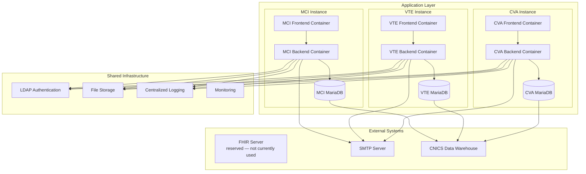
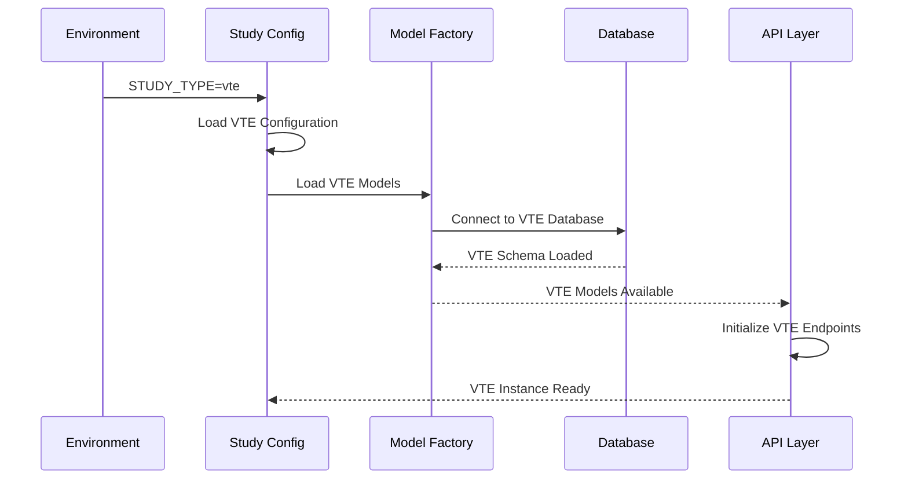
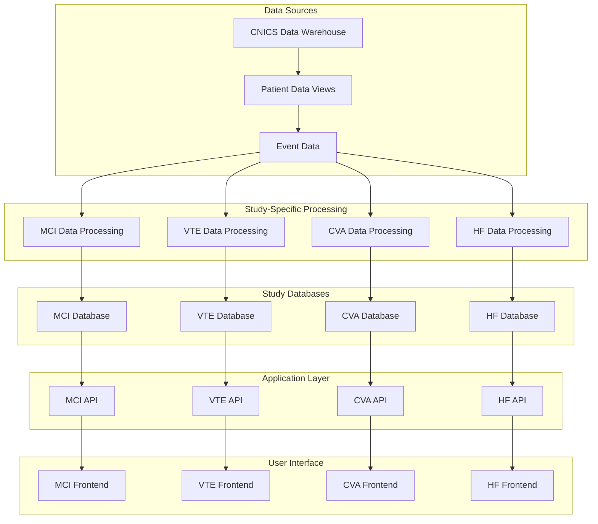
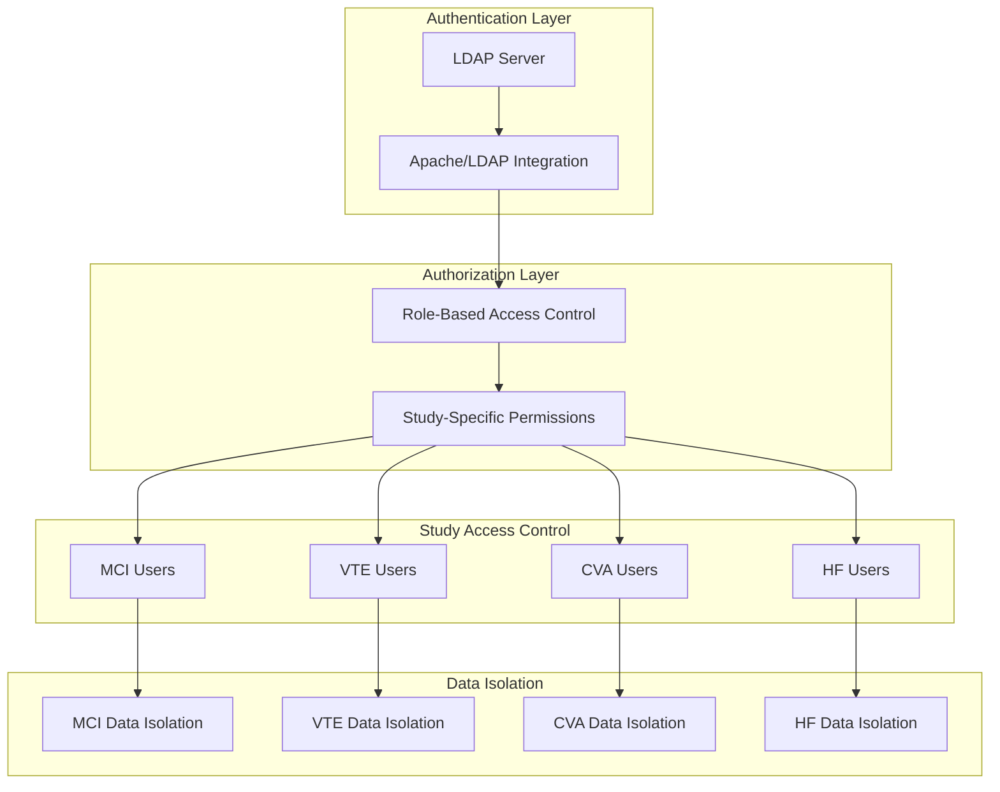
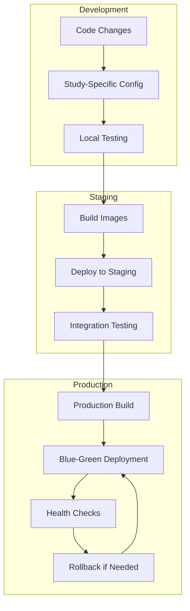
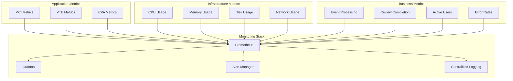
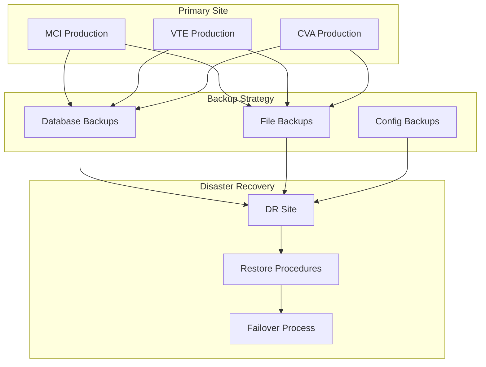
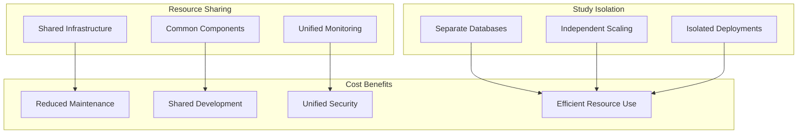

# Technical Architecture Diagrams

## 1. Detailed System Architecture

> **Note on the FHIR Server node:** The FHIR node above is retained as a
> reserved placeholder only. It is **not currently used** — retained for
> backward compatibility; no runtime component reads this value, and no
> study backend currently calls a FHIR server. The node is intentionally
> drawn without edges to make that visually obvious. Any future FHIR
> integration will be tracked as its own feature with its own spec.
>
> **Note on the LDAP Authentication node:** `LDAP Authentication` above
> denotes HTTP Basic Auth at the Apache edge with `AuthBasicProvider
> ldap` (per repository-root [`.htaccess`](../.htaccess)) — not a
> direct LDAP bind from any study backend. After a successful bind,
> Apache forwards the authenticated identity to each study backend as
> the `X-Remote-User` header. Keycloak is **deferred — not part of
> first release**; see `.specify/memory/constitution.md` (Security &
> Data Governance → Authentication) for the decision record.

## 2. Study Configuration Loading

## 3. Data Flow Architecture

## 4. Security and Access Control

> **Note on the Authentication Layer:** For the first release,
> `LDAP Server → Apache/LDAP Integration` in the diagram above is
> `AuthType basic` + `AuthBasicProvider ldap` + `require ldap-group`
> configured in the repository-root [`.htaccess`](../.htaccess). After
> a successful basic-auth bind, Apache forwards the authenticated
> identity to the Flask backend as the `X-Remote-User` header, and
> `Role-Based Access Control` downstream is enforced in the backend
> via `@requires_auth` / `@requires_roles` decorators. Keycloak is
> **deferred — not part of first release**; see
> `.specify/memory/constitution.md` (Security & Data Governance →
> Authentication) for the decision record.

## 5. Deployment Pipeline

## 6. Monitoring and Observability

## 7. Disaster Recovery and Backup

## 8. Cost and Resource Optimization

